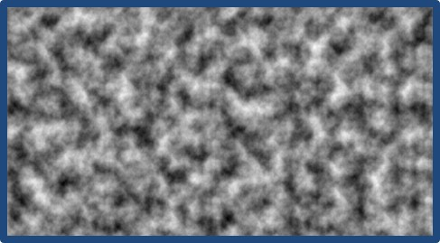

# Procedural-Content-Generation-For-Background-Generation-of-Video-Games

  <!-- Insert an empty line using HTML   tag -->
## What is Procedural Content Generation?
*Procedural Content Generation or PCG is an established method of using algorithmic systems to create video game assets and content. 

*In practice, PCG is the use of algorithms to generate one or more aspects of a game.

*In experimental cases entire games can be built from the ground using PCG to create everything from rules and structure to content and assets .

  <!-- Insert an empty line using HTML   tag -->
## Why PCG?
*Thousands of Games are in the market today.

*Games all feel similar to each other.

*Difficult to produce unique levels to keep gamers interested.

*Time consuming and expensive.

*Huge work force required.

*PCG allows to generate content randomly while also being playable. 

*Also decreases the memory required to store levels.

  <!-- Insert an empty line using HTML   tag -->
## Advantages of PCG
*It creates dynamic content

*It can save on memory usage

*It saves development time and money

*It creates a large variety of options

*It increases replayability

  <!-- Insert an empty line using HTML   tag -->
## Disadvantages of PCG
*You relinquish control*

*It can be taxing on hardware

*It can feel repetitive

*It's hard to script set game events

*It may generate unusable content

  <!-- Insert an empty line using HTML   tag -->
## **Perlin Noise**
*Perlin noise is a type of gradient noise developed by _Ken Perlin_. 

*Perlin noise is a procedural texture primitive.

*The function has a pseudo-random appearance, yet all of its visual details are the same size. 

*This property allows it to be readily controllable

*Multiple scaled copies of Perlin noise can be inserted into mathematical expressions to create a great variety of procedural textures. 

*Synthetic textures using Perlin noise are often used in CGI to make computer-generated visual elements appear more natural, by imitating the controlled random appearance of textures in nature.

  <!-- Insert an empty line using HTML   tag -->

  
  
   <em>images generated using Perlin Noise</em>

